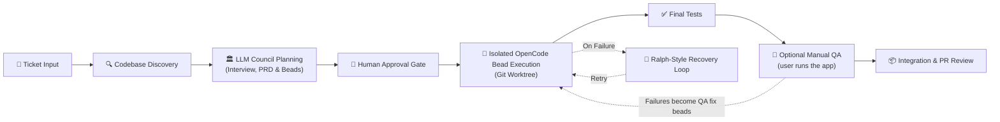

# LoopTroop

> **A smart local engine that automates big coding tasks from start to finish.**
> LLM councils plan it. Ralph loops perfect it. OpenCode worktrees ship it.

LoopTroop helps you turn a coding ticket into a planned, reviewable, agent-executed pull request.

Instead of trusting a single, endless AI chat session - where the conversation history gets bloated, the AI gets confused, and code quality falls off a cliff - LoopTroop breaks the job into clean, separate stages. **Planning** turns an interview into a PRD, which is then split into the smallest manageable milestones, called "beads." **Execution** runs each bead through multiple targeted auto-fix loops. A **final review** ties it all together.

| Architectural Layer | Core | Technical Lifecycle |
| :--- | :--- | :--- |
| **1. Planning** | *LLM Councils Plan It* | Human Input ➔ AI Interview ➔ PRD ➔ Atomic Beads |
| **2. Execution** | *Ralph Loops Perfect It* | Isolated Bead Work ➔ Multi-Loop Automated Testing & Fixing |
| **3. Shipping** | *OpenCode Worktrees Ship It* | Code Isolation ➔ Final Verification Pass ➔ Main Branch Handoff |

**Start here:** [Docs](https://www.looptroop.ovh/docs/) | [Getting Started](https://www.looptroop.ovh/docs/getting-started) | [Ticket Lifecycle Screenshots](https://www.looptroop.ovh/docs/ticket-lifecycle-screenshots) | [LLM Council](https://www.looptroop.ovh/docs/llm-council) | [Context Engineering](https://www.looptroop.ovh/docs/context-engineering) | [Execution](https://www.looptroop.ovh/docs/beads)


*An animated walkthrough of a ticket lifecycle and the configuration menu.*

### 📸 Screenshots

<details>
<summary><strong>Click to expand the screenshot gallery</strong></summary>


*Manage attached repositories, review ticket counts, and add new projects from the dashboard.*


*Choose the main implementer model, council members, and effort levels for local orchestration.*


*Answer focused planning questions before specs and implementation plans are approved.*


*Track council progress, generated artifacts, and live execution logs inside a ticket.*


*Review bead completion, commits, changes, and final implementation details before closing the workflow.*


*Inspect bead-level progress, task status, and live execution logs while an implementation bead runs.*


*Review the focused workspace view shown when an implementation bead is blocked by an error.*


*Compare a different bead's error state, diagnostics, and recovery context before deciding whether to continue or retry.*

</details>

### 🎬 16 Min Deep Dive - Presentation & Full Ticket Demo

<details>
<summary><strong>Click to expand the presentation and demo</strong></summary>

[](https://www.youtube.com/watch?v=LYiYkooc_iY)
*Watch the full 16-minute presentation and ticket demo.*

</details>

---

## Quick start

```bash
curl --proto '=https' --proto-redir '=https' --tlsv1.2 -fsSL https://www.looptroop.ovh/install | sh
looptroop open
```

`open` starts LoopTroop in the background if it is not already running. Use
`looptroop start` if you want the service without a browser.

For maintenance, `clean --apply` rechecks each abandoned worktree immediately
before removal and keeps it when ownership, activity, registration, or Git
state has changed. If Git cannot list registered worktrees, cleanup keeps the
directories in place, including when that check fails after the preview.
Both CLI cleanup and **Free Disk Space** keep worktrees containing ignored
files such as `.env`, dependency folders, or build output, except LoopTroop's
own runtime files. Explicit ticket and project deletion remains destructive.
Process cleanup refuses a signal when the recorded process
identity is missing, recycled, or otherwise unverifiable. See the
[CLI Reference](https://www.looptroop.ovh/docs/cli) for service commands.

When `start` launches a daemon itself, it can still accept that live direct
child if Windows temporarily cannot report its start time. A persisted record
without a verifiable identity is never adopted or signalled by PID alone.
Health checks must return the recorded instance ID. Failed starts can stop
their own live child through the retained process handle, even when the
start-time probe is unavailable. Log follow watches the containing directory
so rename-and-create rotation resumes at the start of the replacement file.

Configure a provider in OpenCode, then choose an available model in LoopTroop's
Configuration screen. LoopTroop detects OpenCode v1 or v2 from the authenticated
server API; it supports both without requiring a major-version change. Attach a
local repository with a GitHub origin, create a ticket, and start it.

If LoopTroop cannot confirm that an OpenCode session stopped remotely, it keeps
the ticket retryable and leaves the ownership visible. The durable session-
ownership marker, `runtime/opencode-pending-sessions.json`, can recover those
session IDs when the project database is unavailable. Cancellation separately
writes the private `.ticket/runtime/cancellation-pending.json` marker before
cleanup; missing means no pending stop, while malformed or unreadable content
fails closed and blocks coding. This cancellation marker records the stop
request but does not identify or recover a remote session. Cleanup removes it
only after terminal cleanup through the contained ticket-file boundary, or
after a CODING Retry has confirmed the previous stop and safely recovered its
bead. If both the database and ownership marker storage are unavailable, only
the current process can guard the session, so a restart cannot claim recovery.

### Every way to install it

<details>
<summary><b>curl / irm</b> — the one-line installer (shown above)</summary>

```bash
curl --proto '=https' --proto-redir '=https' --tlsv1.2 -fsSL https://www.looptroop.ovh/install | sh
```

```powershell
$script = curl.exe --proto "=https" --proto-redir "=https" --tlsv1.2 -fsSL https://www.looptroop.ovh/install.ps1; if ($LASTEXITCODE -ne 0 -or !$script) { throw "Installer download failed" }; & ([scriptblock]::Create(($script -join "`n")))
```

Resolves the newest release, checks the download against the checksum that
release published, and hands it to npm. Because it installs through npm,
`npm install -g looptroop@latest` and `npm uninstall -g looptroop` keep working
exactly as they would have. Pin a version with `--version X.Y.Z` (`-Version` on
Windows). It installs wherever npm's global prefix points; change that with
`npm config set prefix`.

**Needs Node 24.18.0 or newer already installed**, with the npm that came with
it. It never installs Node for you, never asks for sudo, and writes nothing
outside npm's global prefix.

There is also a standalone executable that carries its own Node runtime — see
[Installation](https://www.looptroop.ovh/docs/installation#standalone-executable).
</details>

<details>
<summary><b>npm</b> — everywhere</summary>

```bash
npm install -g looptroop
npm install -g looptroop@latest   # upgrade
```

**Needs Node 24.18.0 or newer**, plus git and `gh`.
</details>

<details>
<summary><b>Homebrew</b> — macOS and Linux</summary>

```bash
brew install looptroop-ai/tap/looptroop
brew upgrade looptroop            # upgrade
```

**Needs nothing else.** The formula pulls in `node@24` and `gh`, and takes git
from the OS. It installs a locked bundle built once per release from the
release lockfile, so everyone on this channel runs the exact versions the
release was tested against.
</details>

<details>
<summary><b>Scoop</b> — Windows</summary>

```powershell
scoop bucket add looptroop https://github.com/looptroop-ai/scoop-bucket
scoop install looptroop
scoop update looptroop            # upgrade
```

**Needs nothing else.** The manifest depends on `nodejs-lts`, `git` and `gh`.
Like Homebrew, it installs the locked bundle built from the release lockfile.
</details>

<details>
<summary><b>Chocolatey</b> — Windows</summary>

```powershell
choco install looptroop
choco upgrade looptroop           # upgrade
```

**Needs nothing else.** The package depends on `nodejs-lts`, `git` and `gh`, and
installs the same locked bundle Homebrew and Scoop do.

A moderator reviews every version before the community feed serves it, so a new
release usually reaches this channel days after the others.
</details>

<details>
<summary><b>WinGet</b> — Windows</summary>

```powershell
winget install LoopTroopAI.LoopTroop

# upgrade — stop first, because Windows will not replace a running executable
looptroop stop
winget upgrade LoopTroopAI.LoopTroop
```

**Needs nothing else.** This channel installs the standalone executable, which
carries its own Node runtime; git and `gh` come from the manifest's declared
dependencies.

Each version is a pull request into `microsoft/winget-pkgs`, reviewed by people
at Microsoft, so a new release usually reaches this channel days after the
others.
</details>

<details>
<summary><b>bun</b> — everywhere</summary>

```bash
bun add -g looptroop
bun add -g looptroop@latest       # upgrade
```

**Needs Node 24.18.0 or newer as well as bun** — the launcher is a Node program,
so bun installs it but Node runs it — plus git and `gh`.
</details>

<details>
<summary><b>pnpm</b> — everywhere</summary>

```bash
pnpm add -g looptroop
pnpm add -g looptroop@latest      # upgrade
```

**Needs Node 24.18.0 or newer as well as pnpm**, plus git and `gh`.

pnpm holds a new version back for about a day: it will not resolve a tag to a
version published in the last 24 hours — a supply-chain protection, on by
default — so `@latest` installs the newest release older than that window.
Asking for an exact version bypasses it.
</details>

<details>
<summary><b>Yarn Classic</b> — Bash/zsh commands</summary>

```bash
yarn global add looptroop
export PATH="$(yarn global bin):$PATH"   # Yarn does not do this for you
yarn global upgrade looptroop@latest     # upgrade
```

**Needs Node 24.18.0 or newer as well as Yarn**, plus git and `gh`.

These commands use Bash or zsh syntax. Yarn Classic also runs on Windows, but a
PowerShell PATH command is not documented here. Use npm on Windows for the
recommended documented setup.

**In Bash or zsh, Yarn does not put its global binaries on `PATH`.** This looks
like a failed install and is not: the add reports success, and then `looptroop`
is not a command. Add the line above to your shell profile, or the next terminal
will have forgotten it. npm, bun and pnpm all install somewhere already on
`PATH`, which is why this catches people out on Yarn alone.

**Yarn Classic (1.x) only.** Yarn 2 removed `yarn global` and never replaced it,
so modern Yarn cannot install a CLI globally at all — and it does not say so
cleanly: `yarn global add looptroop` on Yarn 4 reads `global` as a package name
and fails with a lockfile error. On modern Yarn, run it without installing with
`yarn dlx looptroop`, or install it with one of the other channels.
</details>

<details>
<summary><b>Docker</b> — linux/amd64 and linux/arm64</summary>

```bash
docker pull looptroopai/looptroop:latest
```

**Needs only Docker.** Node, git and `gh` are all in the image. Release images
use the matching tarball and `package-lock.json`, then record the installed
package versions before the multi-architecture image is published. Two things
the image still needs from you, both deliberately not baked in: an OpenCode
server it can reach, and a project mounted at its own absolute path. See the
[Installation page](https://www.looptroop.ovh/docs/installation#running-in-a-container).
</details>

### Standalone executable

Standalone release archives carry Node `v26.9.0` in the executable, so a
downloaded archive runs without Node installed on the host. That embedded
runtime is separate from the application and package floor: Node `24.18.0+`
remains required for the npm, bun, pnpm and Yarn channels. The container
carries its own Node, newer than that floor.

Node 26 is currently the Current release line, with its planned Active LTS
transition on 2026-10-28. Embedded-runtime security maintenance follows
[Node's release schedule](https://github.com/nodejs/Release#release-schedule)
separately from LoopTroop's application-runtime support; dates can change.

**[The Installation page](https://www.looptroop.ovh/docs/installation) is the one
place that tracks which channels are live**, and covers upgrading, uninstalling,
verifying a download against the checksums each release publishes, and running in
a container.

### What you need besides LoopTroop

- **git**, and **`gh`** authenticated, for the pull-request step at the end of a
  ticket. Installed for you via Homebrew, Scoop, Chocolatey, WinGet and the AUR;
  **not** installed if you used npm, bun, pnpm, Yarn or the standalone
  executable, which have no way to declare a dependency.
- **OpenCode**, with a configured provider and available model. LoopTroop starts
  the installed CLI when no server is already reachable, and detects v1 or v2
  automatically. It does not install OpenCode for you.
- On Linux user namespaces, a tool whose owner is the kernel's unmapped
  overflow UID is refused by default, including in a canonical OpenCode
  directory. If you deliberately keep tools in such a directory, set
  `LOOPTROOP_TRUSTED_EXECUTABLE_DIRS` in the daemon's own environment to the
  absolute directory that contains them. Separate multiple directories with
  `:` on macOS/Linux or `;` on Windows; only the directories you name are
  opted in, and a child process cannot change this setting.
- Windows tool discovery uses the supported `.exe`, `.com`, `.cmd` and `.bat`
  entries in `PATHEXT`. It skips script types that need another interpreter,
  such as `.ps1` and `.vbs`, rather than selecting a tool it cannot launch.

## What is LoopTroop?

LoopTroop is a **local GUI orchestrator for long-running, high-correctness AI software delivery** - taking you from a raw idea to merged code. Free and fully open-source.

Unlike high-speed coding tools that optimize for immediate chat responses, LoopTroop is built for **complex, multi-file feature work** where alignment and correctness are paramount. It optimizes for a "slow and perfect" paradigm, intentionally sacrificing raw speed to deliver a final result that matches exactly how you envisioned it.

**Great Context Engineering = Zero AI Slop:** LoopTroop employs precise context curation at every stage, feeding the agent only the absolute **minimum** context it needs. See [Context Engineering](#context-engineering) below for details.

---

## How it works



LoopTroop keeps workflow state outside the model, stores durable artifacts, and asks for approval at important boundaries. Optional Manual QA runs after final tests: you complete the checklist while manually controlling the app, then the ticket continues to integration. Failed checks create QA-fix beads, while improvements creates new tickets.

## Core ideas

### Context Engineering

Context rot is the enemy of autonomous agents. Traditional agent loops suffer from it-excessive conversational history and irrelevant files overwhelm the model, causing code quality to degrade. Performance can drop severely when reaching just 40% of the maximum context window, resulting in missing files, broken imports, and "AI slop." [[note]](https://antekapetanovic.com/blog/context-engineering/ "Context Engineering: When \"You're Absolutely Right\" Means You're Absolutely Not")

LoopTroop solves this through precise context curation. Instead of sending full conversational transcripts, the engine isolates payloads to the active status. During execution, the agent only sees the specific active bead, its immediate file target, and the test file. During planning phases, it receives only the minimum context relevant to the current step.

This eliminates conversation pollution from previous execution attempts, prevents LLM drift and performance degradation, and keeps model focus high. Keeping the working context fresh is what makes multi-hour, multi-step engineering cycles actually work.

Read more: [Context Engineering](https://www.looptroop.ovh/docs/context-engineering)

### LLM Council

The LLM Council is LoopTroop's planning system. Instead of relying on a single model run, LoopTroop orchestrates multiple independent model instances that **draft** plans, **score** each other using a weighted rubric, and **vote** on proposals. The winner then **refines** its draft by synthesizing the strongest ideas from the losing drafts and **verifies** coverage before any execution begins.

This multi-role process (draft → vote → refine → verify) is utilized for:
- Interview questions
- PRD/Specs generation
- Bead/blueprint generation

Read more: [LLM Council](https://www.looptroop.ovh/docs/llm-council)

### Interview

Before writing a spec, the LLM Council compiles a list of targeted questions to resolve any ambiguities. This interactive session gathers requirements and clarifies intent-because matching your vision is the goal, this phase can take over an hour by design.

You answer these questions directly in the Interview workspace to clarify edge cases, design decisions, and requirements, ensuring the model never operates on false assumptions. Although a final interview is created after the council's draft-vote-refine cycle is complete, the user still receives questions in batches that can adapt based on previous answers.

Read more: [Interview](https://www.looptroop.ovh/docs/interview)

### PRD (Product Requirements Document)

Once the interview phase is complete, the LLM Council translates your initial ticket and your interview answers into a structured Product Requirements Document consisting of Epics and User Stories, complete with highly decomposed implementation steps. This spec serves as the single source of truth for the implementation, detailing the technical approach, edge cases, scope, and expected validation steps before any coding starts. The PRD is stored as a durable artifact for later reference during bead execution.

Read more: [PRD](https://www.looptroop.ovh/docs/prd)

### Beads

LoopTroop implements **only the Beads methodology**-not the full external Beads Project-extracting just the lightweight planning structure needed to bring immediate value to your repository.

Using Steve Yegge's *Beads Project* methodology, epics are split into "beads"-the smallest, independently implementable units of work. Each bead contains:
- Clear purpose and objective
- Measurable acceptance criteria
- Necessary dependencies and prerequisite context
- Specific target files
- Expected validation and testing steps

A bead acts as a small, isolated implementation unit, allowing the execution agent to complete concrete tasks sequentially rather than attempting a massive, single-pass code rewrite.

Read more: [Beads](https://www.looptroop.ovh/docs/beads)

Bead approval preserves unknown stored statuses for JSONL repair instead of silently changing them to `pending`. Known aliases still normalize to supported statuses, while approval rejects a missing status or priority rather than inventing one. Executable beads must include their acceptance criteria, tests, and target-file lists, and each test command is a structured command or has an explicit reason for being omitted. Editing waits for the loaded artifact's content hash, so every save can check that it is replacing the version you read; saves return the canonical JSONL and hash that the server wrote. Duplicate bead IDs and malformed nested Manual QA evidence are rejected on authoritative reads, and malformed JSON bodies receive a stable 400 response. Canonical empty fields clear legacy aliases in the editor as they do on the server. YAML repair keeps valid answers, folded text, and literal block text unchanged, including compact nested blocks.

### Execution & Ralph-style recovery

The actual implementation is carried out by an AI coding agent (OpenCode) running in an isolated workspace. If the agent struggles, continuing the same conversation can make things worse. LoopTroop's retry mechanism (the "Ralph Loop") preserves a highly compact error trace from the failure, attempts a safe worktree reset, discards the contaminated session, and begins a fresh run with clean context plus a note from previous failures. A conflicting OpenCode step-cap marker can refuse that destructive reset while preserving the edited config and sidecar; a later bead may continue without a fresh cap when no reset is needed.

```text
fail ──> log failure trace ──> safe reset ──> retry fresh
```

This cycle repeats until all tests pass or retry limits are reached. **This can take hours (sometimes 10+ hours) by design.** It is built to run unattended (e.g., overnight).

When `OpenCode Max Steps` is set, LoopTroop keeps the authoritative restore
marker in its owner-only app configuration at
`<app-config>/opencode-steps/<ticket-directory-hash>.json`, outside the mutable
worktree. A ticket-side `opencode-steps-restore.json` is only a convenient copy
for inspection. If the capped root `opencode.json` is edited, the edited bytes
and authoritative marker stay in place and a destructive reset that would
overwrite them is refused. Ordinary capped runs still retry normally; a later
bead can continue without applying a fresh cap when no reset is needed, and
valid marker evidence keeps the root config out of bead and final commits. A
missing local copy does not erase valid external evidence. A missing marker
after a restart provides no attributable restore operation, so LoopTroop does
not infer ownership from the local copy or from absence; malformed existing
authority likewise stays visible and is not overwritten.
If a live retry loses that marker or cannot reapply the cap after a reset, the
retry stops with the exact marker path and a manual remedy instead of running
uncapped.
Applying the cap does not add a common Git exclude rule.
Filesystem-equivalent casing follows the actual worktree paths; native
Windows/macOS equivalent-case behavior is not claimed here.

Managed OpenCode shutdown keeps its direct process handle until the complete
owned tree is proven gone. On Windows, a leader exit alone is not that proof:
the `/T` taskkill operation must finish successfully as well, so failed or
interrupted cleanup keeps the daemon ownership records available for retry.

Protected Git-hook validation keeps its crash-recovery marker in LoopTroop's
owner-only application data rather than inside the project, so a hook cannot
delete the only record needed to undo its changes. Recovery compares the
current tracked and staged state with that marker before restoring anything;
new or edited files remain untouched until the ambiguity is resolved.

If startup finds an orphan YAML or whole-file JSONL temp without its matching
proof, including an empty JSONL temp, it warns and leaves the temp unpromoted
for inspection. Recovery blocks startup only when an in-progress fallback's
`.recovery` ownership or completeness cannot be verified; that typed diagnostic
appears before projections, ticket hydration, or execution timers, with the
affected files preserved. LoopTroop does not guess or silently promote an
uncertain write.
A new bead stays pending until its reset commit has been recorded. If that read
fails or the ticket is canceled while it runs, no coding session starts; Retry
can attempt the checkpoint again without inventing a reset target. If the
checkpoint was recorded but the status write was interrupted, Retry can also
safely reset that still-pending bead from its recorded anchor; a pending bead
without either marker remains untouched.

Read more: [Beads & Execution](https://www.looptroop.ovh/docs/beads)

### Worktree isolation

LoopTroop runs execution steps inside isolated Git worktrees rather than modifying your active branch. This keeps your working copy clean and ensures reliable, inspectable diffs. Git mutations and resets have bounded process cleanup, unusual filenames stay intact when diffs are read, and generated runtime files stay out of candidate commits. Protected Git-hook validation uses an identity-bound restore marker for the worktree and index; invalid or escaped markers fail before recovery writes, and unknown untracked additions stay intact when attribution is unclear. Note that worktrees provide workspace isolation, not sandboxed host security.

When cleanup is run in its conservative mode, LoopTroop asks Git for ignored
untracked entries in a real worktree and preserves user files; only its own
`.ticket/` and `.looptroop/` roots are eligible for removal. A pre-start ticket
skeleton is checked directly instead of inheriting ignore rules from the parent
repository, and only its `.ticket/` root is eligible. The Free Disk Space action
uses this mode for completed and canceled ticket worktrees: protected worktrees
are skipped and reported with the reason, while eligible worktrees are removed.
An ignored file such as a local environment file therefore remains in place
without preventing other cleanup. If
Git yields while a worktree is being removed, a replacement directory is left
alone. The daemon also waits for detached Git and GitHub children during
shutdown and closes active SSE streams before waiting for its HTTP server, so a
connected browser cannot hold graceful shutdown open indefinitely. Startup
recovery refuses to overwrite a target that has advanced since a completed
fallback copy.

Only select repositories you trust. LoopTroop preserves repository-local Git
configuration, including `core.sshCommand`, so custom SSH wrappers keep working.
Git may execute those wrappers with your account's permissions during remote
operations, including connection checks. Worktree isolation does not restrict
what a wrapper can do on the host.

Read more: [System Architecture](https://www.looptroop.ovh/docs/system-architecture)

## Security boundaries

LoopTroop runs coding agents with your local user permissions. Worktrees keep
repository changes separate, but they do not sandbox the host. Use a disposable
VM or another isolated development environment for unattended runs.

Session cookies require same-origin proof; a bearer header cannot bypass checks
on an accompanying cookie. Local mode requires a loopback Host, and an Origin
matching the request's scheme, hostname, and effective port. Without Origin,
cookie-bearing requests require `Sec-Fetch-Site: same-origin`. Origin parsing
rejects alternate IPv4 spellings and explicit port `0`; configured development
origins remain a separate development-mode exception. For a browser behind a TLS
terminating proxy, set `LOOPTROOP_PUBLIC_ORIGIN` (or `publicOrigin` in
`config.json`) to the one HTTPS origin users open. The backend may remain HTTP;
the setting does not change its bind address, and `LOOPTROOP_ALLOW_REMOTE_API=1`
is still required for remote browser access or when the backend itself is
reachable off loopback, even if the proxy connects to a loopback bind. The
cookie-bearing requests with an Origin must match the configured HTTPS origin
exactly, and their cookies use `Secure`. Without Origin they still require
`Sec-Fetch-Site: same-origin`, and the proxy must preserve the public `Host`;
forwarded host and scheme headers are never trusted. A remote deployment
without the setting is bearer-token only, and the browser session cookie is
rejected even when a bearer header is also present. CLI sign-in links use the
configured public origin while daemon API calls continue to use the internal
address.

Startup rejects a configured public origin unless remote API mode is enabled.
Bearer tokens do not enable browser CORS: a browser request from an unconfigured
origin remains forbidden, while token-only scripts without an Origin can connect.

Server-sent events reserve a connection slot before asynchronous setup begins.
The limits are six connections per ticket and 100 across the daemon. Failed
opens, aborted streams, replay errors, and ticket cleanup release the same
reservation safely; terminal ticket cleanup aborts a pending handshake or
replay write before releasing its slot. Manual QA action IDs use letters,
numbers, `.`, `_`, `:` and `-`, start with a letter or number, and are
limited to 160 characters.

Project commands, Git and hook commands, tool subprocesses, and `doctor`
probes remove `LOOPTROOP_API_TOKEN`, `LOOPTROOP_DEV_EVENT_TOKEN`,
`OPENCODE_PASSWORD`, and `OPENCODE_SERVER_PASSWORD` after their explicit
environment overrides are merged. The backend retains the OpenCode password
aliases for authenticated requests, and a managed OpenCode server receives the
configured aliases it needs. The development web process keeps
`LOOPTROOP_API_TOKEN` for the Vite proxy but does not receive the OpenCode
passwords. Provider and Git credentials stay available where their caller
needs them, and the trusted CLI handoff keeps its configured daemon
environment. This filtering controls credential propagation; it is not a
process sandbox. `LOOPTROOP_API_TOKEN` authorizes the wider bind; it is not the
live API or browser-session token minted by the daemon and recorded in
owner-only daemon state.

Static checks keep process launches and raw filesystem operations at their
approved boundaries. They reject the ordinary static spellings of built-in
loads too: namespace destructuring, direct or zero-expression-template
`require`/`import`, computed string-literal `child_process` methods,
`process.getBuiltinModule`, and re-exports, including computed filesystem
methods, nested `fs.promises`, shell options, and directory APIs. Runtime
callers still rely on contained, no-follow, managed-root, and ticket-root
helpers. The checks use exact filenames and operation allowlists; they do not
provide whole-program alias or dataflow analysis.

### Human approval gates

LoopTroop keeps you in control of critical state transitions. You actively review and sign off on planning specs, execution blueprints, and final pull request deliverables.

For tickets with Manual QA enabled, LoopTroop prepares a checklist while you manually control the app and accept/reject/skip/create new tickets from the items.

Read more: [Ticket Flow](https://www.looptroop.ovh/docs/ticket-flow)


## Run it in a VM

Beyond the install itself — covered per channel above — LoopTroop needs a local
repository with a GitHub origin, and **strongly wants a VM or sandboxed
development environment**.

### Why a VM?

LoopTroop is designed for serious agentic coding work that runs unattended. To make this possible, the orchestrator runs OpenCode in `dangerously-skip-permissions` (YOLO) mode, granting the agent full local execution rights without prompting for confirmation.

While this makes long-running autonomous tasks possible, it introduces real risks. AI agents are not perfect. If a generation goes wrong, the agent can execute commands that delete critical system folders, corrupt active configurations, or break your workspace. Git worktrees isolate your code changes, but they do not sandbox the command execution process itself. The agent runs with your local user privileges.

**Recommended setup: run LoopTroop inside a disposable VM, cloud dev machine, or sandboxed development environment.**

- Git worktrees protect your attached repository checkout
- Logs and artifacts help you inspect what happened
- A VM protects the rest of your computer


## Why not just use a coding agent directly?

Direct coding-agent loops are highly useful, but they degrade rapidly when task complexity or repository scale increases.

| Core Challenge | Direct Agent Behavior | LoopTroop's Structural Fix |
| :--- | :--- | :--- |
| **Flawed Planning** | A single model attempts to draft a multi-step plan in one pass, frequently missing structural edge cases. | **LLM Council Consensus:** Competing models draft, vote on, and synthesize a single, rigorous implementation plan. |
| **Monolithic Overload** | Direct agents try to solve a complex feature in a single massive prompt, leaving incomplete files or "TODO" placeholders. | **Atomic Bead Decompositions:** Automatically breaks down the feature into independent, test-backed "beads" to focus on smallest changes at a time. |
| **Single-Provider Bias** | Relying on one model makes your pipeline highly vulnerable to that specific model's logical blind spots and systemic failures. | **Cross-Model Councils:** Harnesses diverse providers and architectures (e.g., Anthropic, OpenAI, NVIDIA NIM) to critique and align code drafts. |
| **Context Rot** | Long-running chats suffer from token bloat and context degradation, leading to broken imports or forgotten criteria. | **Modern Context Engineering:** The environment strictly isolates context, feeding the agent only the absolute minimum context it needs at each step. |
| **Degenerate Retries** | When a command fails, the agent tries to fix it within the same polluted chat session, compounding previous errors. | **Ralph-Style Retries:** Discards the broken chat session entirely and retries the exact bead with a fresh context window (plus notes from previous failures). |
| **Risky Edits** | Code modifications are made directly in your active checkout, potentially leaving your main branch in an unstable state. | **Isolated Git Worktrees:** Executes all changes in dedicated, isolated worktrees away from your primary working branch. |
| **Opaque Execution** | Internal states, planning notes, and test outputs are lost inside unstructured chat history. | **Structured Durability:** Maintains state locally inside SQLite, JSONL logs, and easily inspectable `.ticket/**` YAML artifacts. |


## What LoopTroop is not

LoopTroop is not a magic autopilot. It does not remove the need to review code, inspect diffs, protect secrets, or run work in a safe environment. It is best understood as an orchestration layer around coding agents: planning, state, approvals, execution boundaries, retries, and delivery.

- **Cost-Sensitive Budgets:** Orchestrating multi-model councils and long retry loops uses a high volume of API tokens, though costs can be mitigated by leveraging subscription plans via providers in OpenCode.
- **Urgent or Quick Fixes:** If you need a trivial change completed in seconds, LoopTroop's overhead will feel slow.
- **Simple Tasks:** For quick edits or trivial apps, standard IDE chat tools or tools like Replit, Bolt, or Lovable are better fits.


## Documentation

The README gives a first-glance overview. The full docs are maintained in the public [LoopTroop-Website repository](https://github.com/looptroop-ai/LoopTroop-Website) and published at:

https://www.looptroop.ovh/docs/

Useful pages:

| Page | What it explains |
| --- | --- |
| [Installation](https://www.looptroop.ovh/docs/installation) | Every channel, what each installs, upgrading, uninstalling, and verifying a download |
| [CLI Reference](https://www.looptroop.ovh/docs/cli) | Every command and option, the `--json` output, and what running as a service means |
| [Getting Started](https://www.looptroop.ovh/docs/getting-started) | Setup, startup, ports, and first project attach |
| [Configuration](https://www.looptroop.ovh/docs/configuration) | All profile settings with defaults, ranges, and trade-offs |
| [Ticket Lifecycle Screenshots](https://www.looptroop.ovh/docs/ticket-lifecycle-screenshots) | Visual walkthrough of every workflow status with screenshots and action summaries |
| [LLM Council](https://www.looptroop.ovh/docs/llm-council) | Multi-model draft, vote, refine, and coverage planning |
| [Context Engineering](https://www.looptroop.ovh/docs/context-engineering) | Why prompts are built from minimal per-status context and what each status receives |
| [Beads & Execution](https://www.looptroop.ovh/docs/beads) | Bead execution, retries, resets, and context wipe notes |

When the app is running, the same docs are also available from the dashboard.

## Project status

LoopTroop is early alpha software, but it is usable for real work. The full ticket lifecycle is implemented, but some bugs are still likely. The core primitives (planning, execution, retries) are functional.

**Configured limitations:** In LoopTroop alpha, LLM Councils support 2–10 distinct models, including the main implementer. Each project may have only one active ticket in the execution band at a time; additional tickets must wait until it finishes or is canceled.

Roadmap: [Roadmap](https://www.looptroop.ovh/docs/roadmap)

## Contributing

Contributions, ideas, bug reports, and workflow feedback are welcome.

See [CONTRIBUTING.md](.github/CONTRIBUTING.md) for setup, issue, pull request, documentation, and changelog guidance. Please also follow the [Code of Conduct](.github/CODE_OF_CONDUCT.md).
